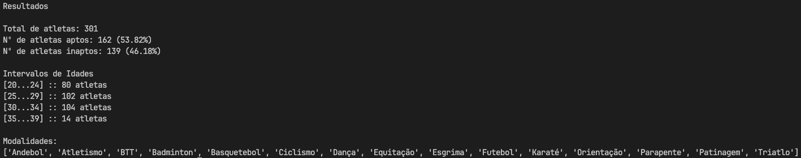

# TP1 - Estatísticas de um Ficheiro
**Autor:** Flávio David Rodrigues Sousa
**Número de Aluno:** 100715

## Descrição do trabalho realizado

### Objetivos
Para a realização deste trabalho, foi necessário um estudo de possíveis estruturas de dados com o objetivo de garantir a eficiência do programa. Durante esse processo, foram definidos dois objetivos principais:

1. **Correção das Estatísticas:**
   O programa deve retornar corretamente as estatísticas solicitadas.

2. **Eficiência no Processamento de Dados:**
   O programa deve operar de forma eficiente, abrindo o ficheiro apenas uma vez, lendo linha a linha e calculando simultaneamente os resultados.

Com esses objetivos delimitados, a seguinte estrutura de dados foi escolhida:

1. **Atletas Aptos:**
   A estrutura mais simples, um inteiro para os atletas aptos e outro para os inpatos - cada um é incrementado sempre que encontrar um atleta apto ou inapto, respetivamente.

2. **Lista de Modalidades**
   Guarda uma dada modalidade se ainda não existir na lista atual. Posteriormente é organizada através da função *sorted()*.

3. **Dicionário de Idades**
   Uma vez que nos foi pedido a caracterização das idades por intervalos de 5 anos; cada idade é divida por 5 e, no dicionário atual, verifica se já existe uma *key* com esse inteiro - se sim, incrementa 1 valor; caso contrário adiciona ao dicionário com um *value* de 1.

## Métodos Implementados
1. **Função *calculate***

   A função *calculate* desempenha diversas tarefas cruciais:
   - Abre o ficheiro para leitura.
   - Processa cada linha, dividindo-a em tokens.
   - Verifica a aptidão do atleta e incrementa o contador correspondente.
   - Analisa a idade, atualiza um dicionário de contagem por intervalo e adiciona a modalidade a uma lista.
   - Invoca a função *results*, fornecendo os parâmetros calculados.

2. **Função *results***

   A função *results* recebe os resultados da função *calculate* e realiza as seguintes ações:
   - Imprime o número total de atletas; número de atletas aptos, inaptos e respetivas percentagens.
   - Organiza o dicionário de idades e imprime os valores por intervalo.
   - Organiza alfabeticamente e imprime a lista de modalidades.

## Conclusão

O presente trabalho foi conduzido com sucesso, alcançando os objetivos estabelecidos de maneira eficaz e eficiente. Durante o processo, foram definidos dois principais objetivos delimitados anteriormente na secção *Objetivos*.

O uso de uma estrutura de dados bem escolhida e a implementação de boas práticas de programação contribuíram para a realização bem-sucedida do trabalho. Os resultados obtidos são consistentes e atendem às expectativas, fornecendo informações valiosas sobre os atletas e as suas atividades.

Em suma, é apresentada, na *imagem 1*, o resultado do programa executado com o arquivo *csv* enviado.

Imagem 1

